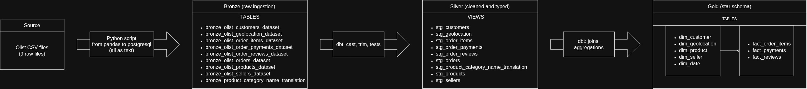

# Olist Data Warehouse

This project is a development of a data warehouse using the dataset
[Brazilian E-commerce by Olist](https://www.kaggle.com/datasets/olistbr/brazilian-ecommerce), witch includes nine csv files.

### ERD for transactional system of Olist

## Setup

1. Download the dataset from [Kaggle](link) into `data/raw/`
2. `pip install -r requirements.txt`
3. Create the PostgreSQL database and schemas (`bronze`, `analytics`)
4. Run ingestion: `python src/ingestion/load_bronze.py`
5. `cd olist_dbt && dbt deps && dbt run && dbt test`

## Technical stack

- **Database**: PostgreSQL
- **Programming language**: Python
- **Data transformation**: dbt
- **Ingestion libraries**: pandas, SQLAlchemy, psycopg2
- **EDA / analysis**: pandas, matplotlib, seaborn, scikit-learn (planned)

# Medallion Architecture

## Bronze layer
Ingestion of the source csv files into postgresql as tables stored in `bronze` schema, reading all the columns as text, also metadata `_ingested_at` and `_source_file` 

## Silver layer
The source data then is typed, cleaned and deduplicated, then is stored in the `analytics` schema as views.

**Cast of the columns to their respective data type**
- Lowercase for text (cities, product category)
- Uppercase for nominal data (states codified as keywords)
- Trimming for qualitative and textual data (cities, states, reviews titles and reviews messages)
- Rounding to 4 decimals for geolocational data (latitude and longitude)
- Rounding to 2 decimals for monetary variables (price, freight value and payments)
- Casting as integers for discrete data (order items, payment sequential, payment installments, review score)
- Casting as timestamps for time data (order purchase, order arrival, posting of reviews)

**Development of tests**
- Unique and not null for primary keys
- Validation of the zip code prefix (customer, seller, geolocation)
- Accepted values for states, payment type, score of the review, status of the order
- Relationships of foreign keys
- Non negative values for prices and freight value

## Gold layer
Lastly, the data is modeled into the `analytics` schema with the next types of tables:

**Dimensions**
- `dim_customer`, `dim_seller`, `dim_product`, `dim_date`, `dim_geolocation`

**Fact tables**
- `fact_order_items` — grain: one product line within an order
- `fact_payments` — grain: one payment method within an order  
- `fact_reviews` — grain: one review within an order

**Development of tests**
- Unique and not null for primary keys
- Accepted values for states, payment type, score of the review, status of the order
- Relationships of foreign keys
- Non negative values for prices and freight value

**Data quality notes**
Some customer/seller zip code prefixes have no matching coordinates in 
`dim_geolocation` a gap inherent to the raw Olist geolocation data, not 
a pipeline error:

- 278 unique customers / 7 unique sellers affected (at `dim_customer`/`dim_seller` level)
- 302 / 253 rows affected in `fact_order_items` (same customers/sellers, 
  counted per order item rather than per unique entity)

These are implemented as `severity: warn` dbt tests rather than blocking 
errors, since the gap is a known limitation of the source data.

Also there are 610 null values without category treated with the label **unknown** and 2 products without physical dimensions.

### ERD for star schema order items 

### ERD for star schema order payments

### ERD for star schema order reviews

### Data Lineage

Full interactive lineage graph (via dbt docs): 
[View data lineage →](https://CAEZARVS2001.github.io/olist-data-warehouse/dbt-lineage/)

## EDA
(in progress)

